# ChatGPT-Like Message Regeneration Feature

## 🎯 **Feature Overview**
When you edit a message, the system now behaves exactly like ChatGPT:
1. **Updates the message content** ✅
2. **Removes all subsequent messages** ✅  
3. **Generates a fresh AI response** ✅

## 🚀 **How It Works**

### Before: Simple Edit
```
User: "Help me with conflict resolution"
AI: "Here's how to resolve conflicts..."
User: "What about negotiation?"
AI: "For negotiation, try these steps..."

→ Edit first message to "Help me with conflict resolution with CEOs"
→ Only the first message changed, everything else stayed the same
```

### After: ChatGPT-Like Regeneration  
```
User: "Help me with conflict resolution"
AI: "Here's how to resolve conflicts..."
User: "What about negotiation?"
AI: "For negotiation, try these steps..."

→ Edit first message to "Help me with conflict resolution with CEOs"
→ Removes "What about negotiation?" and its AI response
→ Generates NEW AI response based on the edited message
→ Fresh conversation continues from that point
```

## 🧪 **Testing Instructions**

### Step 1: Create a Multi-Turn Conversation
1. Start a new chat
2. Send: **"Help me with conflict resolution"**
3. Wait for AI response
4. Send: **"What about negotiation strategies?"**  
5. Wait for AI response
6. Send: **"How do I handle difficult people?"**
7. Wait for AI response

You should now have **6 messages total** (3 user + 3 AI)

### Step 2: Edit and Regenerate
1. **Long-press the first user message** ("Help me with conflict resolution")
2. **Tap "Edit"**
3. **Change it to**: "Help me with conflict resolution with CEOs"
4. **Save the edit**

### Step 3: Observe ChatGPT-Like Behavior
**Watch the console logs:**
```
🔧 [src/ChatScreen] Starting ChatGPT-like edit for message [id]
🔄 [src/ChatScreen] Loading fresh session data...
🔍 [src/ChatScreen] Found message at index 0 of 6
🗑️ [src/ChatScreen] Will remove 5 subsequent messages
🗑️ [src/ChatScreen] Removing subsequent messages from database...
✅ Deleted message [id1]
✅ Deleted message [id2]  
✅ Deleted message [id3]
✅ Deleted message [id4]
✅ Deleted message [id5]
📝 [src/ChatScreen] Updating message content in database...
✅ [src/ChatScreen] Message [id] updated successfully in database
🔄 [src/ChatScreen] Reloading conversation after cleanup...
🤖 [src/ChatScreen] Generating new AI response...
✅ [src/ChatScreen] ChatGPT-like edit completed successfully!
```

**Expected Result:**
- ✅ Conversation now has **2 messages** (1 edited user + 1 new AI)
- ✅ All subsequent messages are **permanently removed**
- ✅ New AI response is **specifically about CEO conflict resolution**
- ✅ Fresh conversation branch from the edited point

### Step 4: Verify Database Persistence
1. **Refresh the app** or **reload the conversation**
2. **Check the conversation** - should still show only 2 messages
3. **Verify database** - deleted messages should not exist in database

## 📊 **Success Indicators**

### ✅ **Working Correctly:**
- **Message count reduction**: 6 messages → 2 messages
- **Console shows deletions**: `✅ Deleted message [id]` for each removed message
- **New AI response**: Content is relevant to the edited message
- **Database cleanup**: Removed messages don't reappear after refresh
- **No errors**: All operations complete successfully

### ❌ **Not Working:**
- **Message count unchanged**: Still shows all 6 messages
- **No deletions in console**: Missing `🗑️ Removing subsequent messages`
- **Same AI response**: AI response hasn't changed
- **Database persistence**: Deleted messages reappear after refresh
- **Errors in console**: Failed delete or update operations

## 🛠️ **Technical Implementation**

### Database Operations
```sql
-- 1. Delete subsequent messages
DELETE FROM conversation_messages 
WHERE session_id = ? 
  AND user_id = ? 
  AND id IN (message_ids_after_edited_message);

-- 2. Update edited message
UPDATE conversation_messages 
SET content = ?, message_timestamp = NOW() 
WHERE id = ? AND user_id = ? AND session_id = ?;

-- 3. Insert new AI response (via chat API)
INSERT INTO conversation_messages (...)
```

### Conversation Flow

```mermaid
graph TD
    A[User Edits Message] --> B[Load Fresh Session Data]
    B --> C[Find Message Index]
    C --> D[Identify Subsequent Messages]
    D --> E[Delete From Database]
    E --> F[Update Edited Message]
    F --> G[Reload Conversation]
    G --> H[Generate New AI Response]
    H --> I[✅ Complete]
```


## 🚨 **Edge Cases Handled**

### 1. **Editing the Last Message**
- **Scenario**: Edit the most recent user message
- **Behavior**: No subsequent messages to delete, just regenerates AI response
- **Expected**: Works normally, generates new AI response

### 2. **Editing an AI Message**  
- **Scenario**: Try to edit an assistant message
- **Behavior**: Should be prevented by the UI (only user messages editable)
- **Expected**: Edit option not available for AI messages

### 3. **Network Failures**
- **Scenario**: Network fails during delete/update operations
- **Behavior**: Partial operations may occur
- **Recovery**: Reload session to see actual state

### 4. **Permission Errors**
- **Scenario**: User tries to edit message belonging to different user
- **Behavior**: Database operations fail due to user_id mismatch
- **Expected**: Error logged, operation fails safely

## 🎯 **Benefits of This Implementation**

1. **True ChatGPT Experience**: Behaves exactly like ChatGPT's edit feature
2. **Clean Conversations**: No orphaned or irrelevant messages
3. **Fresh Context**: AI gets clean context for better responses  
4. **Database Integrity**: Properly removes unwanted data
5. **User Expectation**: Matches what users expect from modern AI chats

## 🔮 **Future Enhancements**

1. **Regenerate Button**: Add "regenerate" option for AI responses
2. **Branch Conversations**: Option to keep both conversation branches
3. **Edit History**: Track previous versions of edited messages
4. **Undo Edit**: Option to restore deleted messages

The message editing now provides a **truly ChatGPT-like experience** with proper conversation regeneration! 🎉 