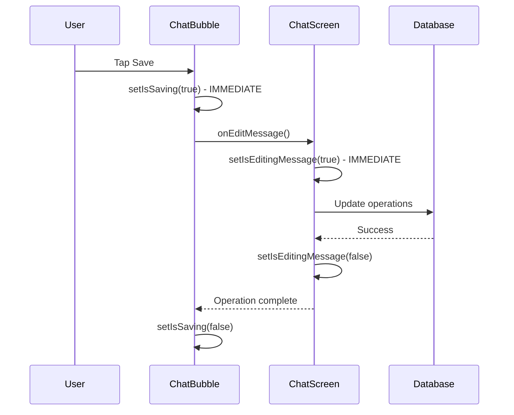

# Edit UX Improvements - Instant Feedback & Double-Tap Prevention

## 🎯 **Problem Solved**
Previously, when users tapped "Save" on an edited message:
- ❌ **Lag before loading indicator** → Users could tap multiple times
- ❌ **No immediate visual feedback** → Confusing UX
- ❌ **Duplicate messages sent** → Required cleanup later
- ❌ **Save button remained active** → Could trigger multiple operations

## ✅ **UX Improvements Implemented**

### 1. **Immediate Visual Feedback** (`ChatBubble.tsx`)
- ✅ **Instant loading spinner** replaces checkmark when saving
- ✅ **Save button disabled immediately** after first tap
- ✅ **Cancel button dimmed and disabled** during save
- ✅ **Text input becomes read-only** with accent border color
- ✅ **Clear visual states** for saving vs ready

### 2. **Double-Tap Prevention** (`ChatScreen.tsx`)
- ✅ **Global edit lock** prevents multiple simultaneous edits
- ✅ **Immediate state setting** before async operations
- ✅ **Proper cleanup** in finally block
- ✅ **Duplicate detection** logs and ignores extra taps

## 🎨 **Visual Changes**

### Before Save (Ready State)
```
💬 [Message text in edit box]
   [❌ Cancel] [✅ Save]  ← Both buttons active
```

### During Save (Loading State)  
```
💬 [Message text - read only - accent border]
   [❌ Cancel - dimmed] [⏳ Spinner] ← Save shows spinner, cancel disabled
```

### After Save (Regenerating)
```
💬 [Updated message]
🤖 [Thinking indicator...]  ← AI generating new response
```

## 🧪 **Testing Instructions**

### Test 1: Single Tap Behavior
1. **Edit a message** and make changes
2. **Tap "Save" once**
3. **Observe immediate feedback:**
   - ✅ Save button shows spinner immediately
   - ✅ Cancel button becomes dimmed
   - ✅ Text input becomes read-only with accent border
   - ✅ No lag before visual feedback

### Test 2: Double-Tap Prevention
1. **Edit a message** and make changes
2. **Rapidly tap "Save" multiple times** (simulate double-tap)
3. **Check console logs:**
   ```
   💾 [ChatBubble] Starting save operation...
   🔧 [src/ChatScreen] Starting ChatGPT-like edit for message [id]
   ⚠️ [src/ChatScreen] Edit already in progress, ignoring duplicate request
   ⚠️ [src/ChatScreen] Edit already in progress, ignoring duplicate request
   ```
4. **Verify only one edit operation occurs**

### Test 3: No Duplicate Messages
1. **Edit first message** in a multi-message conversation
2. **Rapidly tap save** or try to trigger duplicates
3. **Verify clean result:**
   - ✅ No duplicate user messages in UI
   - ✅ No duplicate AI responses generated
   - ✅ Clean conversation flow
   - ✅ Console shows only one save operation

### Test 4: Error Handling
1. **Edit a message** (disconnect internet to simulate failure)
2. **Tap save** and let it fail
3. **Verify recovery:**
   - ✅ Loading state clears after error
   - ✅ Save button returns to checkmark
   - ✅ Text input becomes editable again
   - ✅ Error alert shown
   - ✅ Can attempt save again

## 📊 **Success Indicators**

### ✅ **Working Correctly:**
- **Instant feedback**: Save button changes to spinner immediately
- **No double operations**: Console shows only one edit per save attempt
- **Clean UI states**: Clear visual progression through saving states
- **Smooth UX**: No confusing delays or unclear states
- **Proper cleanup**: Always returns to ready state after completion/error

### ❌ **Still Issues:**
- **Delayed feedback**: Any lag before spinner appears
- **Double operations**: Multiple edit operations in console logs
- **UI state stuck**: Save button stuck in loading state
- **Duplicate messages**: Multiple user messages or AI responses
- **Missing feedback**: No visual indication during save

## 🛠️ **Technical Implementation**

### Visual State Management
```tsx
// Immediate state changes in ChatBubble
const handleSave = async () => {
  setIsSaving(true);  // 🔧 IMMEDIATE visual feedback
  try {
    await onEditMessage(messageId, editedText.trim());
  } finally {
    setIsSaving(false);  // Always cleanup
  }
};

// Visual states based on isSaving:
- Save button: checkmark → spinner
- Cancel button: normal → dimmed + disabled  
- Text input: normal → read-only + accent border
```

### Double-Tap Prevention
```tsx
// Global edit lock in ChatScreen  
const handleEditMessage = async (messageId, newContent) => {
  if (isEditingMessage) {
    return false;  // 🔧 PREVENT duplicate operations
  }
  
  setIsEditingMessage(true);  // 🔧 IMMEDIATE lock
  try {
    // ... edit operations
  } finally {
    setIsEditingMessage(false);  // Always unlock
  }
};
```

### State Synchronization


## 🎯 **Benefits**

1. **Professional UX**: Instant feedback like modern apps
2. **No User Confusion**: Clear visual states at all times
3. **Prevents Errors**: No duplicate operations or messages
4. **Better Performance**: Prevents unnecessary API calls
5. **Error Resilience**: Proper cleanup on failures

## 🔮 **Future Enhancements**

1. **Progress Indicator**: Show edit progress (delete → update → regenerate)
2. **Optimistic Updates**: Show changes immediately, sync in background
3. **Undo Feature**: Quick undo for accidental edits
4. **Keyboard Shortcuts**: Ctrl+Enter to save, Escape to cancel

The edit experience now provides **instant, professional feedback** with complete double-tap prevention! 🎉 