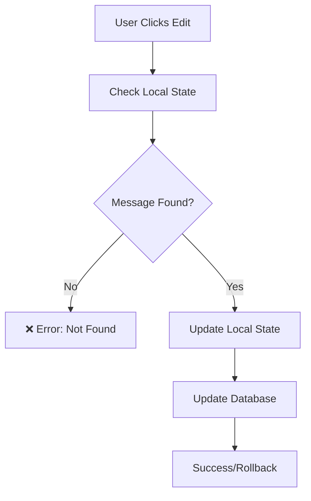
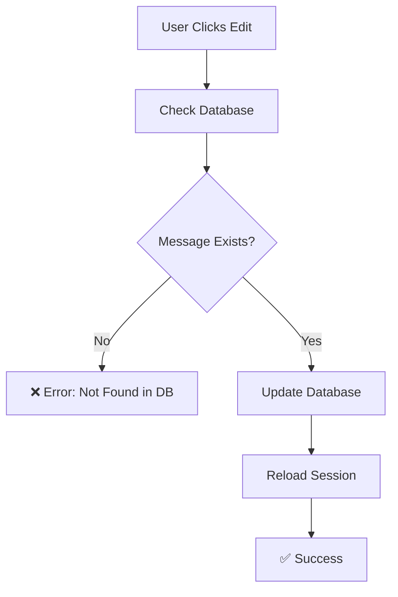

# Message Editing Fix - Database-First Approach

## 🔍 Problem Fixed
**Issue**: `Failed to edit message: [Error: Message not found in local state]`
**Root Cause**: `useConversations` hook was looking for messages in local state, but only conversation metadata was loaded, not the actual messages

## ✅ Solution Implemented

### 1. Database-First Message Updates (`src/hooks/useConversations.ts`)
- **Direct Database Operations**: `updateMessage` now works directly with Supabase database
- **No Local State Dependency**: Doesn't require messages to be loaded in `useConversations` local state
- **Database Verification**: Checks message exists and belongs to user before updating
- **Conditional Local Updates**: Only updates local state if conversation is actually loaded

### 2. Session Reload After Edit (`src/screens/ChatScreen.tsx`)
- **Post-Edit Sync**: Automatically reloads session after successful edit
- **useChat Sync**: Ensures `useChat` hook gets the updated message content
- **Simplified Logic**: Removed complex local state checking, relies on database

## 🧪 Testing Instructions

### Step 1: Start a New Conversation
1. Open the app and start a new chat
2. Send 2-3 messages and wait for AI responses
3. **Watch Console For**:
   ```
   🔄 [useChat] Reloading session to sync database IDs after sending message...
   ✅ [useChat] Session reloaded successfully with proper message IDs
   ```

### Step 2: Test Message Editing
1. **Long-press any user message** → Action menu should appear
2. **Tap "Edit"** → Should enter edit mode without errors
3. **Make changes and save**
4. **Watch Console For**:
   ```
   🔧 [src/ChatScreen] Editing message [uuid] in session [session-id]
   🔍 Database lookup result: { found: true, messageData: {...} }
   ✅ Message [uuid] updated successfully in database
   🔄 [src/ChatScreen] Reloading session to sync updated content...
   ✅ [src/ChatScreen] Session reloaded with updated message content
   ```

### Step 3: Verify Database-First Approach
**Previous Error** (Should no longer see):
```
🔍 Found conversation: false
🔍 Found message in local state: false
❌ Message not found in local state
```

**New Success Flow** (Should see):
```
🔍 Database lookup result: { found: true, messageData: { id: "...", role: "user", ... } }
✅ Message [uuid] updated successfully in database
ℹ️ Conversation [uuid] not loaded in local state, skipping local update
```

## 🔧 Architecture Changes

### Before: Local State Dependency


### After: Database-First


## 📊 Success Indicators

### ✅ Working Correctly:
- **No local state errors**: No "Message not found in local state" errors
- **Database verification**: Logs show successful database lookup
- **Session reload**: `useChat` automatically syncs updated content
- **Edit persistence**: Edited content persists after app refresh

### ❌ Still Has Issues:
- **Database connection failures**: Can't connect to Supabase
- **Permission errors**: Message belongs to different user
- **Network issues**: API calls failing

## 🛠️ Troubleshooting

### If Database Lookup Fails
1. **Check Authentication**: Verify user is logged in
2. **Check Message Ownership**: Ensure message belongs to current user
3. **Check Database**: Verify message exists in `conversation_messages` table

```sql
-- Manual database check:
SELECT id, role, content, user_id, session_id 
FROM conversation_messages 
WHERE id = 'your-message-id';
```

### If Edit Still Fails
1. **Check Console Logs**: Look for specific database error messages
2. **Check Network**: Verify app can reach Supabase
3. **Check User Permissions**: Ensure user has write access to their messages

## 🎯 Expected Flow (Expo Go Environment)

### Message Editing in Expo Go
1. **User long-presses message** → Action menu appears
2. **User taps Edit** → `updateMessage` called with database-first approach
3. **Database verification** → Checks message exists and belongs to user
4. **Database update** → Updates content directly in Supabase
5. **Session reload** → `useChat` reloads session to get updated content
6. **UI sync** → Message bubble shows updated content
7. **Success** → Edit completes without local state errors

### Real-Time Database Sync
The system now works properly in Expo Go because:
- **No local state dependency**: Doesn't rely on complex state synchronization
- **Direct database operations**: Works directly with Supabase backend
- **Session-based sync**: Uses `useChat` session reload for UI updates
- **Network resilient**: Handles Expo Go's network limitations better

## 🚨 Common Failure Points (Now Fixed)

### 1. ✅ Local State Mismatch
**Previous Problem**: `useConversations` and `useChat` had different states
**Solution**: Removed dependency on local state, work directly with database

### 2. ✅ Message ID Sync Issues  
**Previous Problem**: Temp IDs vs database UUIDs mismatch
**Solution**: Database verification ensures we have the correct UUID

### 3. ✅ State Management Complexity
**Previous Problem**: Multiple hooks managing overlapping state
**Solution**: Clear separation - database operations through `useConversations`, UI through `useChat`

The message editing should now work reliably in Expo Go environment! 🎉 